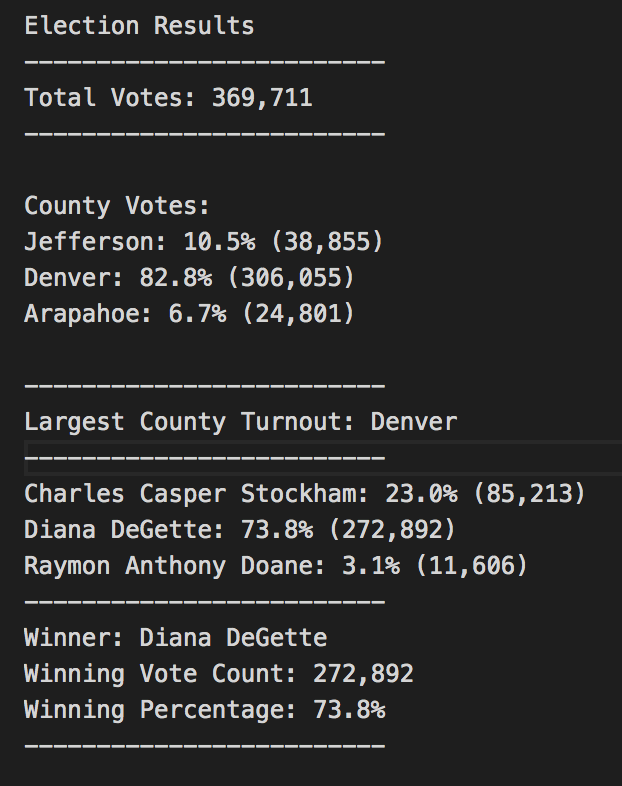

# Election_Analysis

## Overview of Election Audit

Tom and Seth, the Colorado Board of Election employee have given the task to complete the most recent local congressional election. This project aims to arrive at the final election audit results to the election commission. We are using Python to find the followings:
- The voter turnout for each county (Arapahoe, Denver, Jefferson)
- The percentage of votes from each county out of the total count
- The county with the highest turnout.

## Election-Audit Results

After running the code in Python, there are 369,711 votes in total. 
- County votes:
    - Jefferson: 10.5% (38,855 votes in total)
    - Denver: 82.8% (306,055 votes in total)
    - Arapahoe: 6.7% (24,801 votes in total)
- Largest county turnout to be Denver
- Candidate votes:
    - Charles Casper Stockham: 23.0% (85,213 votes in total)
    - Diana DeGette: 73.8% (272,892 votes in total)
    - Raymon Anthony Doane: 3.1% (11,606 votes in total))
- The winner of this election is Diana DeGette
    - Winning vote count: 272,892
    - Winning percentage: 73.8%

  Please see Figure 1 for Results: 

## Election-Audit Summary

The code in Python and this script can be used for any election in the future. First of all, we wrote a for loop script that would add a vote to the county’s vote count. Then, we calculated the percentage of the county’s vote against total vote. Most importantly, we had put a decision statement in code that would help us to determine the winner county that has the largest vote count. With the code we wrote, it can be used for any election data in the future because we had put what result we would like to see in Python. So that, Python will follow the instruction we made to help us to reach the final result. Also, the code is like an language that we put in Python, which is readable and there is no need to specify the data type. Therefore, it would work with similar election data in the future.
